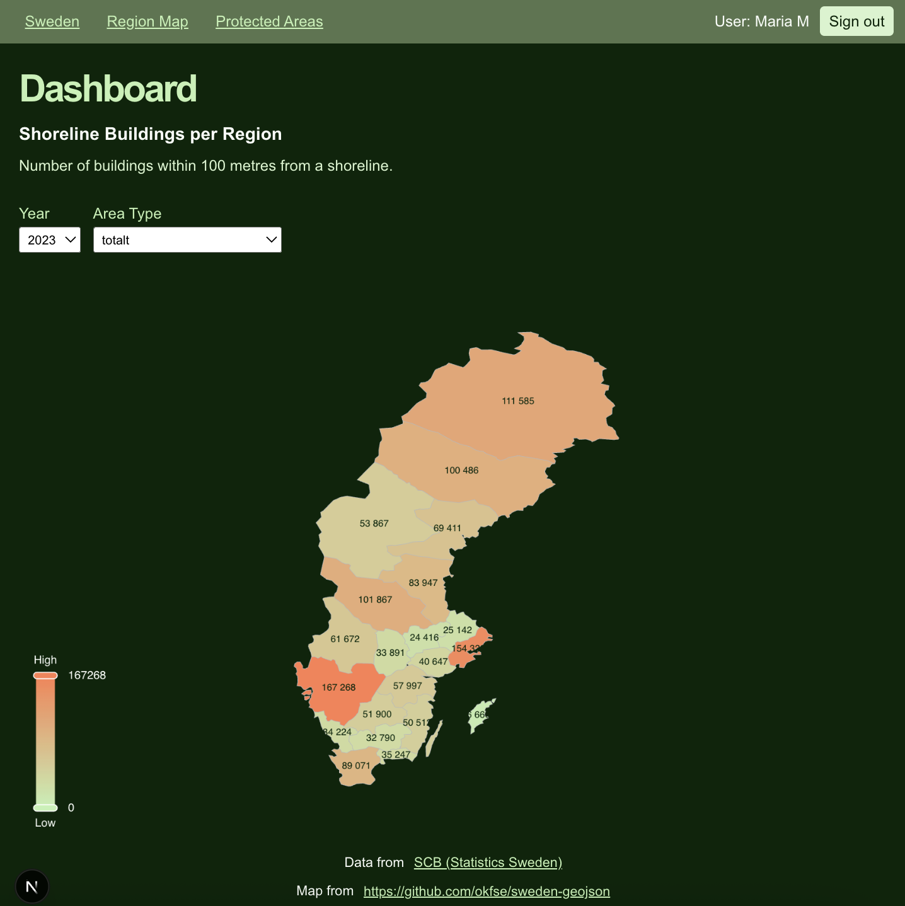
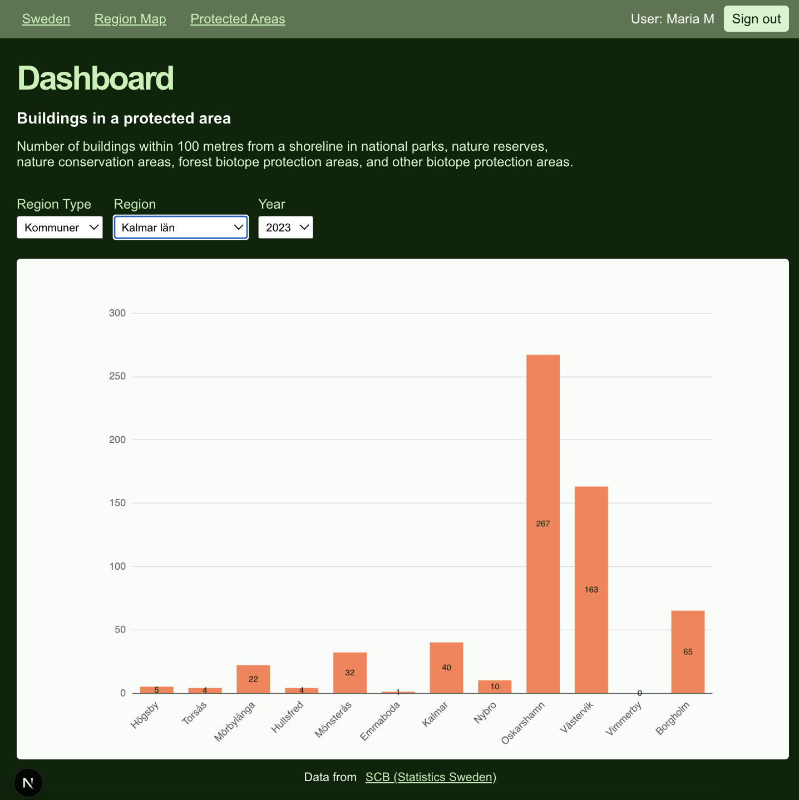

# Shoreline buildings in Sweden 🌊🏡 (Minimized version)

This application exposes an API to query for data about shoreline buildings in Sweden.
It also has a client application that shows the data from the API on a dashboard.
  
_This is a minimized version that does not contain all data available from the source, no GraphQL mutations and therefore no authentication service for mutations._

## Demo
### Video
Watch a demo of the application: [Demo of the Shoreline Buildings application (Youtube, 1:20 min)](https://youtu.be/GV7vf3J9VeY)

### Screenshots
  

## Usage
To use the dashboard, visit [https://shorelinebuildings.mariamair.se/](https://shorelinebuildings.mariamair.se/) and log in with Google.

To use the API, use the production URL [https://shorelinebuildings.mariamair.se/api/graphql](https://shorelinebuildings.mariamair.se/api/graphql).

API documentation: [https://shorelinebuildings.mariamair.se/api](https://shorelinebuildings.mariamair.se/api)

Test documentation: [https://documenter.getpostman.com/view/39898331/2sBXigNZNU](https://documenter.getpostman.com/view/39898331/2sBXigNZNU) 

## Scope
> This application is a minimized version of the [Shoreline Buildings application](https://github.com/mariamair/shoreline-buildings) that I developed as a school project for the course [1DV027](https://kursplan.lnu.se/kursplaner/kursplan-1DV027-1.000.pdf).

## Data source
Data used: [Byggnader i strandnära läge efter region och byggnadstyp. År 2018 - 2023](https://www.statistikdatabasen.scb.se/pxweb/sv/ssd/START__MI__MI0812__MI0812S/MI0812T01/) (Shoreline buildings by region and type of building. Year 2018 - 2023)  
Source: [Statistics Sweden](https://www.scb.se/en_/)

## Project structure
The application uses 
- a GraphQL API for the data resources with
  - a PostgreSQL database 
  - a Python seed
  - a Java / Spring Boot backend
- an interactive dashboard for data visualization with
  - React/Next.js
  - Apache ECharts
  - OAuth 2.0 / OpenID Connect with Google
- a CI/CD pipeline (Github Actions) with automated API tests (Postman/Newman)
